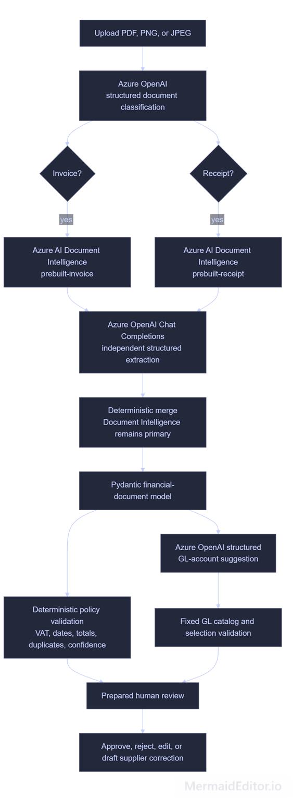
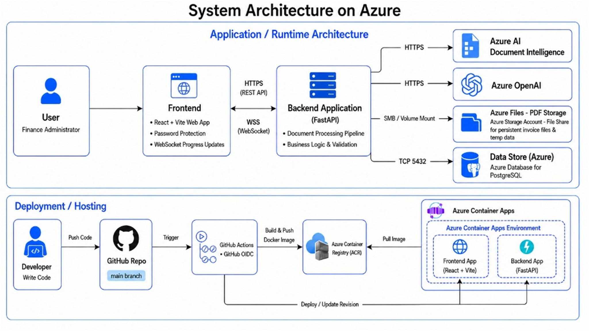

# Invoice Review

An AI-assisted financial-document review application for Northstar Facilities
B.V., a fictional European facilities-management company. Finance
administrators can upload multilingual invoices and receipts, review extracted
financial data, resolve validation findings, select a general-ledger account,
and make an explicit approval decision.

The application combines Azure AI extraction with deterministic finance rules:
AI suggests and extracts information, while the application owns VAT checks,
total reconciliation, duplicate detection, approval policy, and the final
human decision.

This project was built alongside the [Invoice Review tutorial](https://learn.datalumina.com/docs/invoice-review).

## AI Workflow



## System Architecture



## What it does

- Recognizes invoices and receipts with structured Azure OpenAI classification.
- Extracts financial fields and line items with Azure AI Document Intelligence.
- Uses an independent Azure OpenAI review to fill only missing primary fields,
  while retaining source provenance and conflicts.
- Applies separate invoice and receipt validation policies, including offline EU
  VAT format/checksum checks and total reconciliation.
- Suggests a general-ledger account from a fixed, reviewable catalog.
- Streams processing progress to the browser and preserves review history.
- Runs as one Azure Container App, with PostgreSQL for review data and Azure
  Files for uploaded documents.

The repository includes a fictional multilingual sample corpus only; no real
financial documents or secrets are committed.

## Prerequisites

- Python 3.12 or newer
- uv
- Node.js 22 or newer
- pnpm 11

## Install project libraries

Install both sets of project libraries before running the application. These
commands use the committed lockfiles, so everyone installs the same dependency
versions.

```bash
# Backend Python libraries
cd backend
uv sync --locked

# Frontend JavaScript libraries
cd ../frontend
pnpm install --frozen-lockfile
```

Copy `backend/.env.example` to `backend/.env` and `frontend/.env.example` to
`frontend/.env`, then add the required Azure service configuration. Do not
commit either environment file.

## Run locally

After installing the backend and frontend dependencies, run one of the scripts
below from the repository root. Each starts the FastAPI backend and Vite
frontend in the same terminal; press `Ctrl+C` to stop both services.

PowerShell:

```powershell
.\scripts\dev.ps1
```

Bash:

```bash
bash ./scripts/dev.sh
```

The frontend is available at `http://127.0.0.1:5173` and the backend at
`http://127.0.0.1:8000`.

## Verify the installation

After completing the locked installations above, run the checks below from the
repository root. They lint and compile the backend, then type-check, lint, and
produce a production frontend build.

```bash
cd backend
uv run --locked --no-sync ruff check app
uv run --locked --no-sync python -m compileall -q app

cd ../frontend
pnpm exec tsc -b --pretty false
pnpm lint
pnpm build
```

See the [client brief](docs/client-brief.md) for the product scenario and
[deployment instructions](docs/deployment.md) for the Azure environment.
